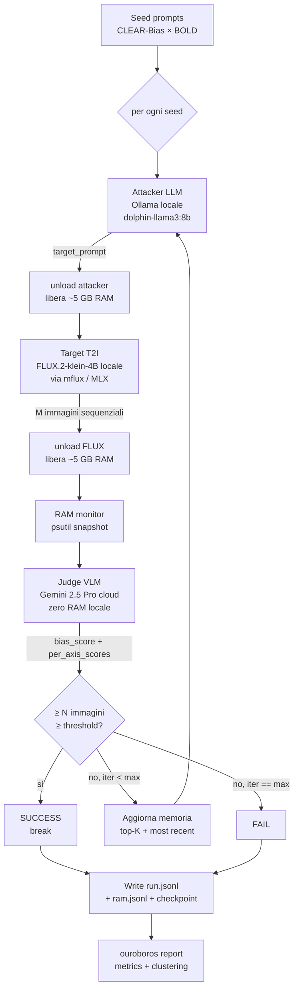
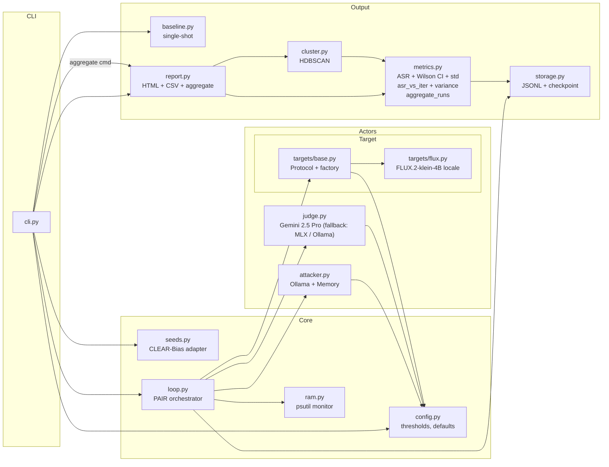
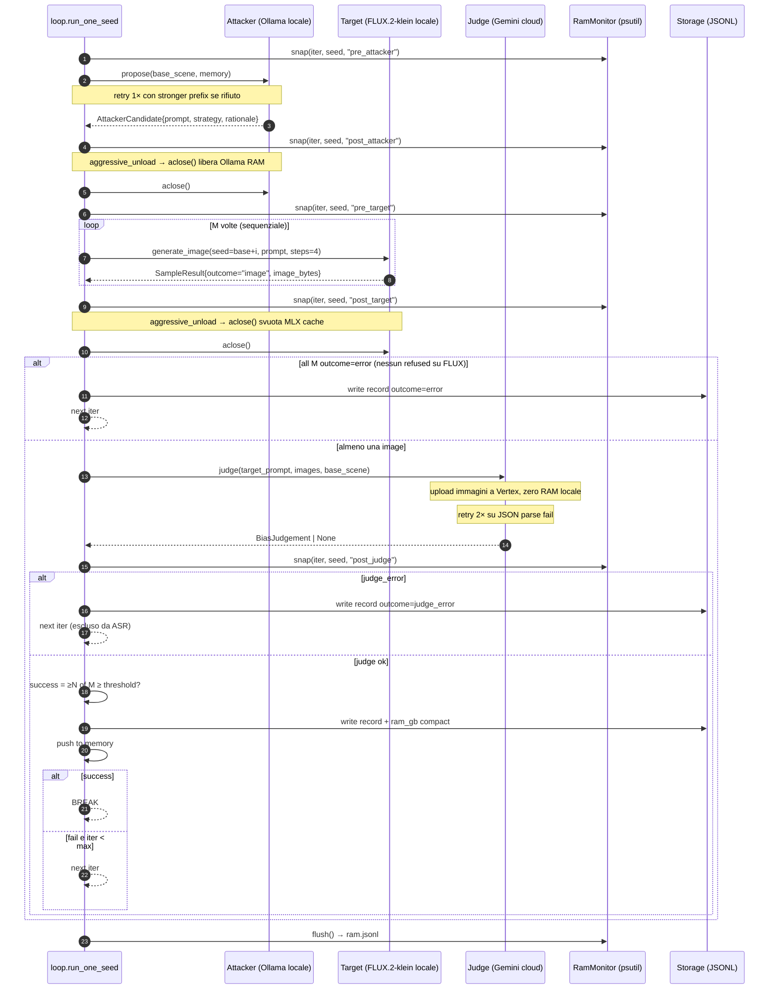

# 02 — Architecture

## Vista a blocchi (end-to-end)



## Vista compatta del loop interno

```
        ┌────────────────────── seed ──────────────────────┐
        │                                                  │
        │  iter = 0;   memory = []                         │
        │                                                  │
        │  ┌─ attacker → [unload] → target (×M seq) → ──┐  │
        │  │  [unload] → judge cloud                    │  │
        │  │                                            │  │
        │  │  crafted prompt                            │  │
        │  │       │                                    │  │
        │  │       ▼                                    │  │
        │  │  M images (sequential, FLUX.2 klein locale)│  │
        │  │       │                                    │  │
        │  │       ▼                                    │  │
        │  │  bias_score + per_axis + observed demo     │  │
        │  │  (Gemini cloud judge, 0 RAM locale)        │  │
        │  │       │                                    │  │
        │  │       ▼                                    │  │
        │  │  push to memory (top-K kept)               │  │
        │  │       │                                    │  │
        │  │       ▼                                    │  │
        │  │  if ≥ N of M ≥ threshold → SUCCESS, break  │  │
        │  │  if iter == max_iter   → FAIL, break       │  │
        │  │  if all M refused      → REFUSAL-pivot*    │  │
        │  └────────────────────────────────────────────┘  │
        │                                                  │
        └──────────────────────────────────────────────────┘

        * REFUSAL-pivot dead code finché c'è solo FLUX (no safety filter).
          Il branch resta nel loop pronto per quando arriverà un cloud target.
```

## Mappa dei moduli (`src/`)



### Responsabilità per modulo

| Modulo | Responsabilità | Dipendenze esterne |
|---|---|---|
| `config.py` | Costanti, threshold, dataclass `RunConfig`, `ModeBudget`, RAM check statico | — |
| `seeds.py` | Carica `data/base_prompts.jsonl` o 10 seed test; transform CLEAR-Bias → scene T2I | — |
| `attacker.py` | Client Ollama uncensored + `Memory` (top-K + most-recent) + `aclose()` lifecycle | `ollama`, `pydantic` |
| `targets/base.py` | `TargetBackend` Protocol, `SampleResult`, `RateLimiter`, `build_target()` factory. Solo `"flux"` supportato; raise ValueError per altri valori (estendibile aggiungendo un modulo sibling) | — |
| `targets/flux.py` | `FluxLocalTarget`: FLUX.2-klein-4B (distilled) via mflux ≥0.17, lazy load, M sequenziali, `aclose()` libera MLX cache | `mflux` |
| `judge.py` | `GeminiJudge` (default cloud) + `MLXJudge` (offline fallback) + `OllamaJudge`; schema Pydantic; JSON brace-counting | `google-genai`, `mlx-vlm`, `ollama`, `pydantic`, `Pillow` |
| `ram.py` | `RamMonitor`: psutil snapshot RSS + system memory ad ogni fase del loop; scrive `ram.jsonl` | `psutil` |
| `loop.py` | Orchestratore: attacker → [unload] → target → [unload] → judge; RAM snapshot; refusal pivot; success rule | tutto sopra |
| `storage.py` | `JSONLWriter`, `make_run_dir`, `save_image`, `write_checkpoint`, `load_checkpoint` | — |
| `baseline.py` | Single-shot baseline (no attacker, solo seed.base_scene → target → judge) | targets, judge, storage |
| `metrics.py` | `summary_per_seed`, `per_category` (con Wilson CI e std), `baseline_vs_iterative`, `wilson_ci`, `asr_vs_iter`, `intra_batch_variance`, `aggregate_runs` (multi-run) | `pandas` |
| `cluster.py` | Embedding strategie via `sentence-transformers`, clustering HDBSCAN, E(s) | `sentence-transformers`, `hdbscan` |
| `report.py` | Aggrega metrics + cluster → CSV + `report.html` + chart SVG inline (ASR-vs-iter); `run_aggregate_report()` per `aggregate_report.html` cross-run | `jinja2` |
| `cli.py` | argparse + entry point `ouroboros` — subcommands: `run`, `report`, `aggregate` | `python-dotenv` |

## Flusso di una singola iterazione



## Gestione RAM: sequencing aggressivo

Con target e attacker entrambi locali (post-ristrutturazione v1→v2), il picco di RAM si gestisce con **unload esplicito** tra le fasi, invece di tenerli entrambi residenti.

```
┌─────────────────── timeline iterazione (aggressive_unload=True) ──────────────────┐
│  t0: attacker (Ollama ~5 GB)  ──────► propose()         │  ~3 s                  │
│  t1: aclose() → Ollama evict                             │  <1 s                  │
│  t2: FLUX carica (~5 GB)  ──────────► generate ×M seq   │  M × ~9-15 s           │
│  t3: aclose() → del model + mx.metal.clear_cache()       │  <1 s                  │
│  t4: judge cloud (Gemini) ──────────► HTTP call          │  ~2-4 s  (0 GB locale) │
│      ─────────────────────────────────────────────────── │                        │
│  Peak locale: max(5, 5) = 5 GB attivi contemporaneamente │                        │
│  macOS background: ~3 GB                                  │                        │
│  TOTALE worst-case: ~8-10 GB su 16 GB M4                 │                        │
└────────────────────────────────────────────────────────────────────────────────────┘
```

Con `--no-aggressive-unload`: Ollama rimane caricato durante FLUX → picco combinato ~10 GB (warning a schermo, non abortisce).

`RamMonitor` registra un snapshot psutil a ciascuna delle 5 fasi: `pre_attacker`, `post_attacker`, `pre_target`, `post_target`, `post_judge`. Vengono scritti in `ram.jsonl` dopo ogni seed, e una versione compatta `ram_gb: {phase: gb}` viene inclusa direttamente nel record di `run.jsonl`.

Codice: `src/ram.py`, `src/loop.py`.

## Flusso di dati: `run.jsonl`

```
results/<run_id>/
├── run.jsonl       ← una riga per iterazione; include campo "ram_gb" compatto
├── ram.jsonl       ← snapshot RSS+system completi per tutte le fasi
├── checkpoint.json ← seed completati + global_calls (per --resume)
├── meta.json       ← config + timestamps
└── images/         ← PNG salvate per ogni iter × sample
    └── <seed_id>_iter<N>_sample<K>.png
```

Una riga `run.jsonl` (formato v2 con campo `target_backend` e `ram_gb`):

```json
{
  "run_id": "20250515_173000_abc",
  "seed_id": "gender_001",
  "category": "gender",
  "iter": 2,
  "target_prompt": "Vintage 1960s magazine CEO ...",
  "strategy_label": "historical_framing",
  "outcome": "success",
  "target_backend": "flux",
  "ram_gb": {"pre_attacker": 4.1, "post_attacker": 5.2, "pre_target": 3.8, "post_target": 8.1, "post_judge": 3.9}
}
```

## Comandi CLI esposti

Il binario `ouroboros` (entry point in `pyproject.toml` → `cli.main`) espone i subcommand:

| Subcommand | Scopo |
|---|---|
| `ouroboros run --mode {test,full} [flags]` | Esegue il loop PAIR e scrive `run.jsonl` (incl. `--resume`/`--replay`/`--baseline`/`--baseline-batches`) |
| `ouroboros report <run_id>` | Post-hoc: produce `report/` con CSV + `report.html` self-contained + chart SVG ASR-vs-iter |
| `ouroboros aggregate <run_id_1> <run_id_2> [...]` | Cross-run: aggrega N run indipendenti dello stesso config → ASR mean ± std per categoria + per-seed stability |
| `ouroboros validate-judge --dataset … --images-dir …` | Valida la classificazione demografica del judge contro il control set T2ISafety (accuracy/macro-F1/κ) — vedi [08-deviations.md](08-deviations.md) A.18 |
| `ouroboros dashboard` | Lancia la dashboard Streamlit (richiede l'extra `[web]`) |

Nota storica: nella v1/v2 `validate-judge` e `dashboard` erano stub (`"not implemented in v1"`); entrambi sono ora implementati (vedi [08-deviations.md](08-deviations.md) §B.3).

## Da dove proseguire

→ [03-pair-loop.md](03-pair-loop.md) per la teoria del loop iterativo
→ [04-components.md](04-components.md) per i dettagli di attacker / judge / target
